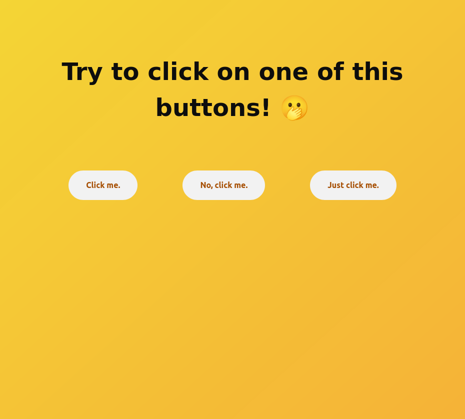
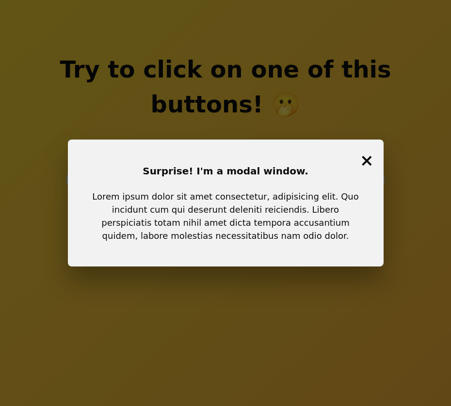

# Modal Window

## What is a modal?

In web and application design, a popup modal window is a user experience pattern that is often employed to interrupt a user’s activity, drawing their attention to something more important. Typically a modal window takes the form of a graphic element that appears in front of all other page content.

A modal window gets its name from the fact that triggering of the window is accompanied by a change in mode. When this happens, areas outside the modal window are deactivated until users either react to instructions that appear within the modal box itself, or close the window.

Modals are usually triggered when a user clicks on a specific modal HTML or CSS element or takes a certain action.

## The use of Modals

Modals break the flow of the user experience and feel like an interruption, so in principle, it's always a good idea to design your application such that modals aren't necessary.

Before making a modal in your application, ask this question first:

- Is what you have to display in this modal more important than the task your user is trying to accomplish?

## Built with

- HTML
- SCSS
- JavaScript

### Screenshots

## Credits

Thanks to @jonasschmedtmann for the inspiration for this project as well for being such a great teacher.
